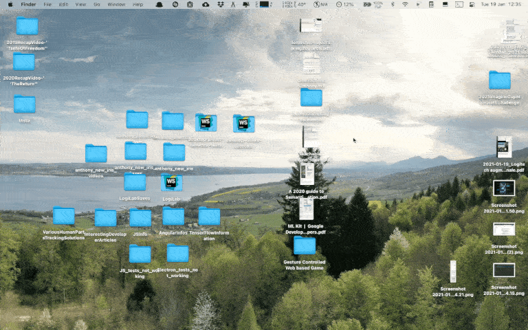

# rename_screenshots.py
Simple Python program used to automatically rename the Screenshots situated on
the Desktop.

## Table of contents
* [1. Description](#1-description)
* [2. Getting started](#2-getting-started)
    * [2.1 Dependencies](#21-dependencies)
    * [2.2 Installing](#22-installing)
    * [2.3 Executing program](#23-executing-program)
* [3. Version history](#3-version-history)

<!-- toc -->

## 1. Description
`rename_screenshots.py` is a simple Python program that automatically renames
the ".jpg", ".png" and ".mov" screenshot files situated on the Desktop. By default, the
program simply removes the "Screenshot " text at the beginning of the name of
each screenshot, but the program can be customized to rename the screenshots as
needed. The Alfred workflow "Rename Screenshots" can also be used as a shortcut
to quickly execute the program from anywhere by typing the `ren` hotkey in the
Alfred search bar. Tested with the [Alfred v3.4 macOS app](https://www.alfredapp.com).

## 2. Getting started

### 2.1 Dependencies
* Tested on macOS Catalina version 10.15.7
* Python, standard version

### 2.2 Installing
No specific packages need to be installed, the program uses only the `os` and
`glob` packages.

### 2.3 Executing program
Type following command at the root of the project:

`python rename_screenshots.py`

## 3. Version history
* 0.1
    * Initial release